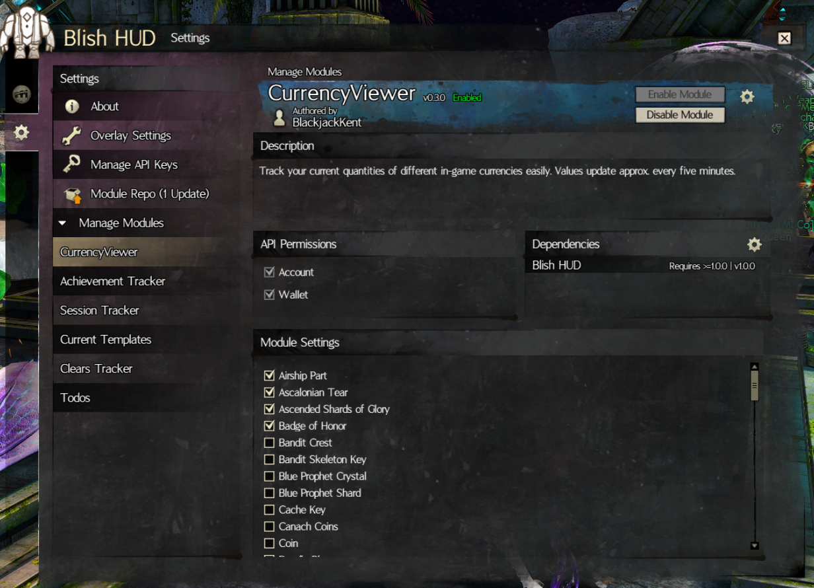
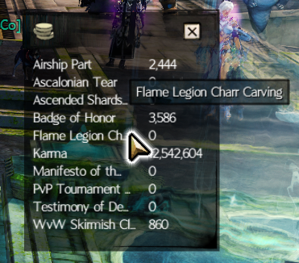

# BlishHud Currency Viewer

This is a module for the [BlishHud](https://blishhud.com) framework of plugins for Guild Wars 2. It allows users to select a subset of in-game currencies that they are interested in monitoring, and displays them in a quick-access window in alphabetical order and updates their count approximately once every five minutes.

